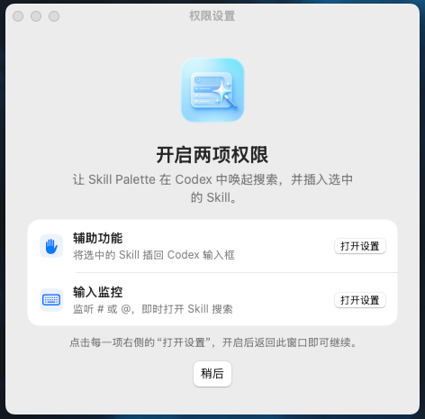
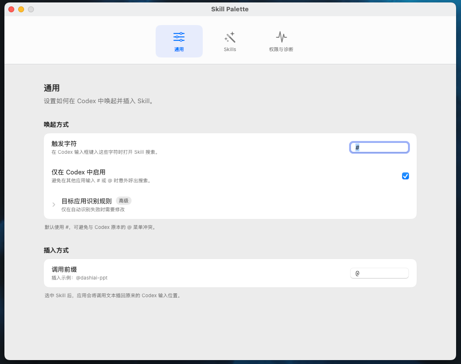
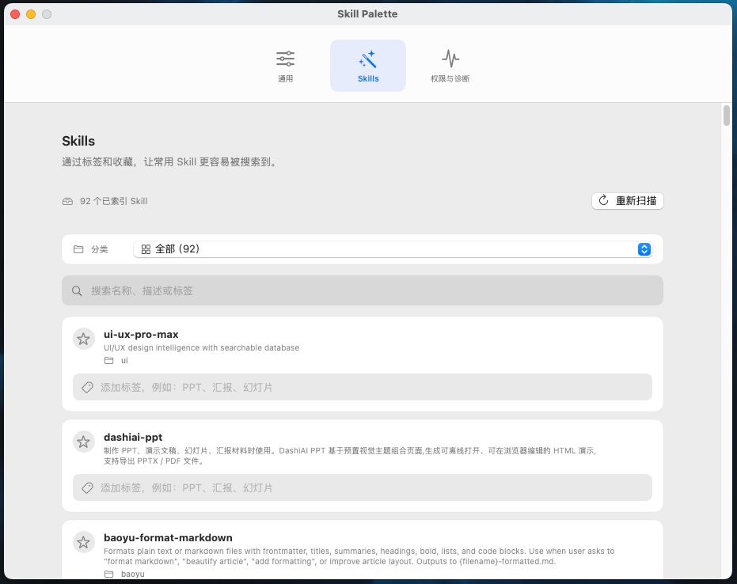
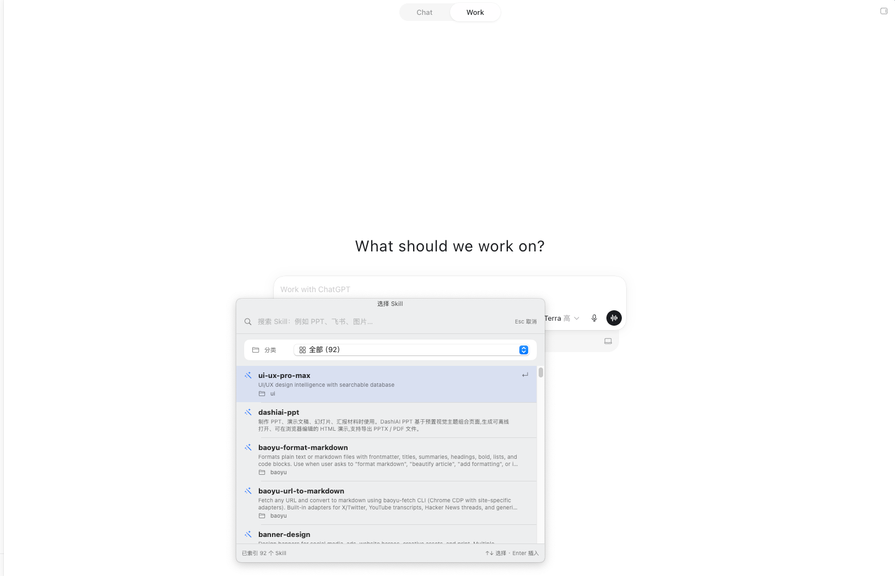

# Skill Palette

[English](#english) · [简体中文](#简体中文)


## 简体中文

**Skill Palette** 是一个轻量的 macOS 工具：当你在 Codex 输入默认触发字符 `#`（或在设置中改为自己的自定义字符）时，它会立即弹出本机 Skill 搜索，让你按名称、描述或标签找到 Skill，并将调用文本写回原来的输入框。

### 功能

- 在 Codex 输入默认 `#` 或自定义触发字符唤起搜索，不必记住完整 Skill 名称。
- 支持中文关键词、标签与模糊搜索；例如 `PPT`、`飞书`、`图片`、`Excel`。
- 按本机目录分类浏览 Skills，并支持收藏常用 Skill。
- 选中后自动插入 `@skill-name` 到原来的 Codex 输入位置。
- 只读取本机 `~/.codex/skills` 与 `~/.agents/skills` 中的 `SKILL.md`；不会上传你的 Skill 内容或键盘输入。
- 内置权限引导和诊断页，便于检查辅助功能、输入监控和键盘监听状态。

### 截图

| 权限引导 | 通用设置 |
| --- | --- |
|  |  |

| Skill 管理 | 在 Codex 中选择 Skill |
| --- | --- |
|  |  |

### 安装

1. 在 [Releases](https://github.com/weiweidounai0131/skill-palette/releases/latest) 下载最新版 `Skill-Palette-1.1.5-macos.zip`。
2. 解压后将 `Skill Palette.app` 拖入“应用程序”或任意本地文件夹。
3. 首次启动时按引导开启两项 macOS 权限：
   - **辅助功能**：将选中的 Skill 插回 Codex 输入框。
   - **输入监控**：监听默认 `#` 或自定义触发字符，并即时打开搜索。
4. 回到 Codex，点击输入框后输入 `#`，开始搜索。

### 从源码构建

要求：macOS 13 或更高版本，以及 Xcode Command Line Tools 或 Xcode。

```bash
./build.sh
open "build.noindex/Skill Palette.app"
```

### 使用提示

- 默认触发符为 `#`，避免与 Codex 原生的 `@` 菜单冲突。
- 按 `Esc` 取消搜索时，原先输入的触发字符会保留在 Codex 输入框中。
- 默认只在应用名称或 Bundle ID 含 `codex` / `chatgpt` 时启用；可在“通用”页调整。

## English

**Skill Palette** is a lightweight macOS utility for calling local Codex Skills. Type the default `#` trigger in Codex, or configure your own trigger character, to open a fast local search and insert an invocation back into the original prompt.

### Highlights

- Open local Skill search from Codex with the default `#` or a custom trigger character; no need to remember long Skill names.
- Search using natural keywords, Chinese tags, and fuzzy matching.
- Browse Skills by local folder and star frequently used entries.
- Insert `@skill-name` directly into the original Codex input field.
- Reads only local `SKILL.md` files from `~/.codex/skills` and `~/.agents/skills`. No Skill content or keystrokes are uploaded.
- Includes guided macOS permission setup and a diagnostics page for Accessibility, Input Monitoring, and the keyboard listener.

### Screenshots

| Permission guidance | General settings |
| --- | --- |
|  |  |

| Skill management | Choosing a Skill in Codex |
| --- | --- |
|  |  |

### Install

1. Download `Skill-Palette-1.1.5-macos.zip` from [Releases](https://github.com/weiweidounai0131/skill-palette/releases/latest).
2. Unzip it and move `Skill Palette.app` to Applications or another local folder.
3. On first launch, grant both macOS permissions:
   - **Accessibility** — inserts the selected Skill into Codex.
   - **Input Monitoring** — listens for the default `#` or your custom trigger to open search.
4. Return to Codex, focus the composer, and type `#`.

### Build from source

Requires macOS 13 or later and Xcode Command Line Tools or Xcode.

```bash
./build.sh
open "build.noindex/Skill Palette.app"
```

### Tips

- `#` is the default trigger to avoid conflicting with Codex's native `@` menu.
- Press `Esc` to dismiss the search palette and keep the trigger character in the Codex composer.
- By default, the trigger is limited to apps whose name or bundle identifier includes `codex` or `chatgpt`. You can change that in General settings.

## Privacy

Skill Palette works locally. It does not send your Skills, search terms, or keystrokes to a server.

## License

Copyright © 2026 Jiang Jiawei. All rights reserved.
